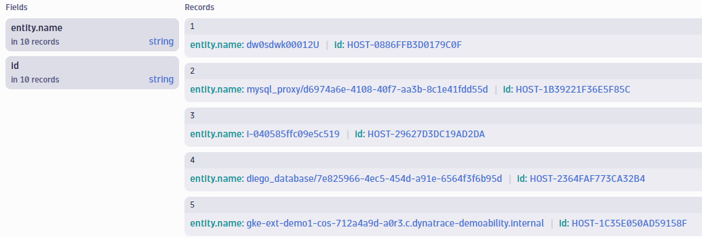
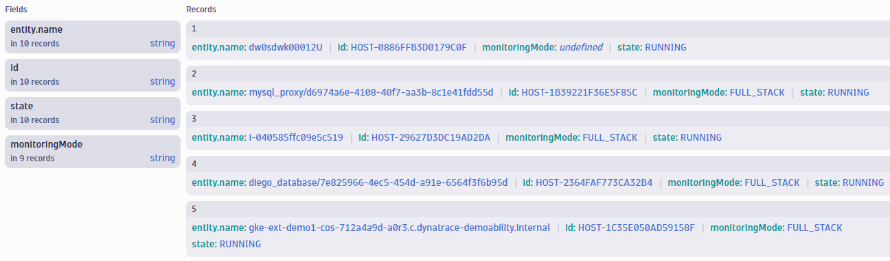
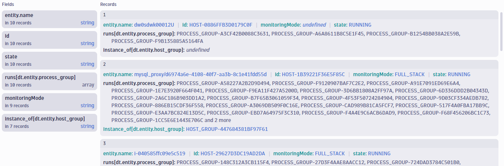

## Hands-On Exercise 2 - Querying Entities

In this section, you will practice querying entities and relationships with DQL.

---

### Step 1: Create a New Notebook

For this exercise, we will be querying Grail from within a Notebook.

Navigate to the **Notebooks** application and create a new notebook.

Name this notebook "Entity Exercises".


<br>
<br>

---

### Step 2: Get a List of Hosts

In our new notebook, we will begin by querying a list of hosts.

Add a new section to your notebook and choose "Query Grail".


#### Write and execute a query to obtain a list of hosts, and limit to 10 results.

<br>


<details>
<summary>Click to Expand Solution</summary>
<br>
<br>

```
fetch dt.entity.host
| limit 10
```


</details>

<br>
<br>

---

### Step 3: Add Additional Fields

Notice that by default, the only data returned for each host is the entity name and entity id.  

You can add additional fields to the output by using the **fieldsAdd** command.

Add the fieldsAdd command to your query.  You will see a list of suggested fields you can add to the results.  


#### Add monitoring mode and state to the results.


<details>
<summary>Click to Expand Solution</summary>

```
fetch dt.entity.host
| fieldsAdd monitoringMode, state
| limit 10
```



</details>
<br>
<br>

---

### Step 4: Add Related Entities

Entity relationships are available to add as fields in a DQL query.  This includes relationships such as:
- which hosts belong to a host group
- which processes run on a host
- which services run on a process group

and many more.


#### Using relationship functions, add the following to the results:
-  A list of **process groups** running on each host.
- The **host group** each host belongs to.

(**Hint**: See the [Relationship Mapping Table](https://www.dynatrace.com/support/help/shortlink/grail-querying-monitored-entities#relationship-mapping-table) for information on the relationship functions available in DQL.)
<br>

<details>
<summary>Click to Expand Solution</summary>

```
fetch dt.entity.host
| fieldsAdd monitoringMode, state, runs[dt.entity.process_group], instance_of[dt.entity.host_group]
| limit 10
```



</details>
<br>
<br>

---

### Step 5: Add Host Group Name

In the last step, you added the entity ids of the process groups and host group related to each host.  However, it would be more user friendly to have the names of these entities included in the results.

The **lookup** command can be used to join data from related entities.


For example, the following query fetches a list of service instances, the hosts they run on, and then the names of those hosts using the **lookup** command.

Query:
```
fetch dt.entity.service_instance
| fieldsAdd runs_on[dt.entity.host]
| lookup sourceField:`runs_on[dt.entity.host]`, lookupField:id, [ fetch dt.entity.host ]
```
Result:


<br>

#### Using the lookup command, add the name of the host group to the results.
<br>

<details>
<summary>Click to Expand Solution</summary>

```
fetch dt.entity.host
| fieldsAdd monitoringMode, state, runs[dt.entity.process_group], instance_of[dt.entity.host_group]
| lookup sourceField:`instance_of[dt.entity.host_group]`, lookupField:id, [ fetch dt.entity.host_group]
```


</details>
<br>
<br>

**Note:** 

The **lookup** command will only work if the sourceField value is a <u>single ID</u>.  If the sourceField value is a list, such as the list of process groups, the query will return an error.


In this case, you would first need to use the **expand** command to retrieve individual records per process group.  This is not covered in this lab.  To learn more, see [documentation](https://www.dynatrace.com/support/help/shortlink/grail-querying-monitored-entities#expand-relationships).

<br>
<br>