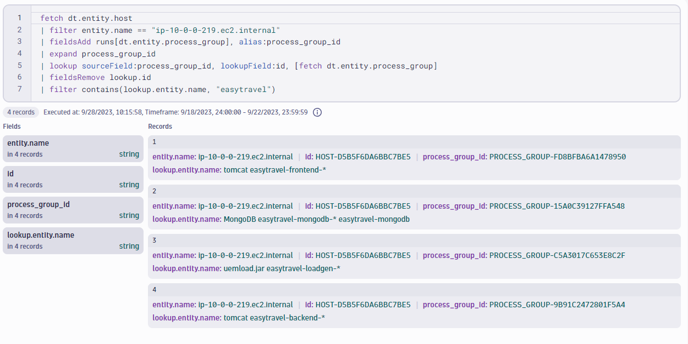

## Hands-On Exercise 4 - Additional Exercises

In this section, you will find additional exercises to practice and test your abilities querying logs.

### Exercise 1 - Logs

...

### Exercise 2 - Entities

**In the [HOT session environment](https://zcy16892.apps.dynatrace.com/), pick one host and fetch a list of all the process groups running on that host that contain "easytravel" in their name.  There may be more than one possible solution.**

HINT: Try to solve this exercise using the **Expand** command mentioned at the end of the previous entity exercises.
 
<H4><details>
<summary>Possible Solution</summary>

```
fetch dt.entity.host
| filter entity.name == "ip-10-0-0-219.ec2.internal"
| fieldsAdd runs[dt.entity.process_group], alias:process_group_id
| expand process_group_id
| lookup sourceField:process_group_id, lookupField:id, [fetch dt.entity.process_group]
| fieldsRemove lookup.id
| filter contains(lookup.entity.name, "easytravel")
```



</details></H4>
<br>
<br>


### Exercise 3 - Timeseries

...