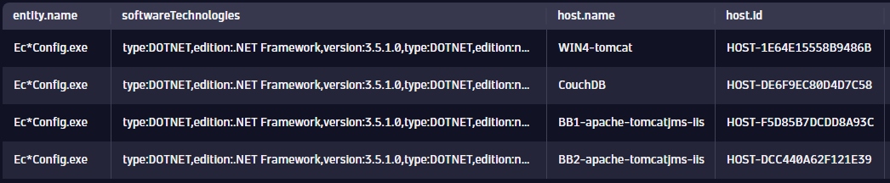
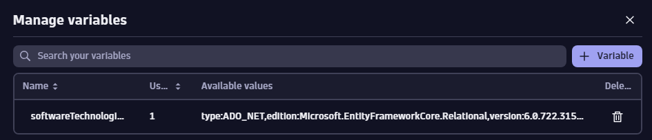
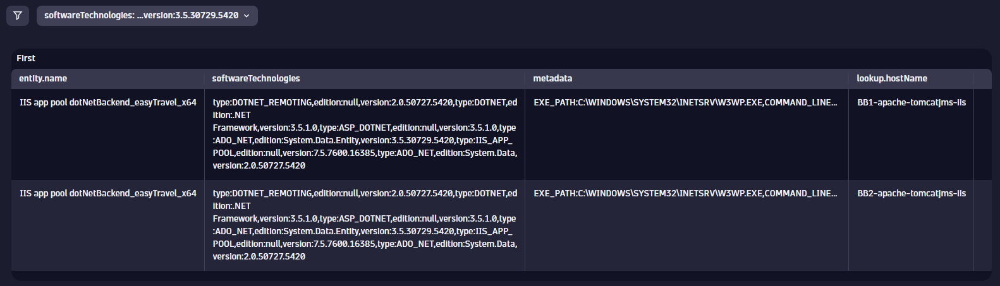

## Hands-On Exercise 4 - Entity Queries in Practice

In this section, you will work through a practical use case using entity queries in DQL. The familiar Dynatrace entity model is available directly in DQL queries, giving you direct access to entity relationships and properties. 

---

### Step 1: Filter entities based on specific criteria
One of the things we can use DQL and entities is to provide as much insight and visibility into processes potentially affected by known vulnerabilities. For example, there was situation where a specific Windows patch and .NET Framework 3.5 resulted in a vulnerability.

For these kinds of situations, the entity information available in GRAIL gives us the means to look for the Process Group Instances (PGIs) that could potentially be affected by.

We will begin by querying for a list of PGIs based on their technology type. In a new Notebook, add a new section and choose "Query Grail".

#### Write and execute a query to obtain a list of PGIs where technology is .NET and the version contains '3.5'. Make sure to add the 'softwareTechnologies' column to confirm that the .NET version 3.5 is being met. Here is an example of a result we are looking for.


<H4><details>
<summary>Click to Expand Solution</summary>
<br>

```
fetch dt.entity.process_group_instance
| filter processType == "DOTNET" and contains(toString(softwareTechnologies), "3.5")
| fieldsAdd softwareTechnologies
```
</details></H4>

---

### Step 2: Add additional context information regarding these applications
As you can see, that simple query is giving us the list of potentially affected processes by a known vulnerability. With this we can start adding contextual information, such as which hosts the applicaiton processes are running on.

#### Update the query to add information about the underlying host.


(**Hint**: You can use the **belongs_to** entity relationship field that provides the underlying host information. In order to display the ID, you will need to process the contents of this field. Check out [String functions](https://www.dynatrace.com/support/help/platform/grail/dynatrace-query-language/functions#dql-string-functions), in this case **toString** and **substring**)

<H4><details>
<summary>Click to Expand Solution</summary>
<br>

```
fetch dt.entity.process_group_instance
| filter processType == "DOTNET" and contains(toString(softwareTechnologies), "3.5")
| fieldsAdd softwareTechnologies
| fieldsAdd belongs_string = toString(belongs_to)
| fieldsAdd host = substring(belongs_string, from:indexOf(belongs_string, ":")+2, to:lastIndexOf(belongs_string, "\""))
| fieldsRemove belongs_string
```
</details></H4>
---

---

### Step 3: Add the underlying host name
Now that we have extracted the underlying host entity ID, we can use this information to look up the host display name.

#### Update the query to add the underlying host name.



(**Hint**: We will need to use the lookup command (Refer to the DQL HOT 1 Entities session). Check out [lookup command documentation](https://www.dynatrace.com/support/help/platform/grail/dynatrace-query-language/commands#lookup))

<H4><details>
<summary>Click to Expand Solution</summary>
<br>

```
fetch dt.entity.process_group_instance
| filter processType == "DOTNET" and contains(toString(softwareTechnologies), "3.5")
| fields entity.name, softwareTechnologies, belongs_to
| fieldsAdd belongs_string = toString(belongs_to)
| fieldsAdd host = substring(belongs_string, from:indexOf(belongs_string, ":")+2, to:lastIndexOf(belongs_string, "\""))
| lookup [fetch dt.entity.host 
  | filter osType == "WINDOWS" 
  | fields name=entity.name, id ], sourceField:host, lookupField:id, prefix:"host."
| fieldsRemove belongs_to, host, belongs_string
| sort entity.name asc
```
</details></H4>
---


## Additional Exercise

Even though the previous example is very useful, it is a very specific, and dynamic applicable because we are hardcoding the technology we are looking for into our query. Wouldn’t it be way better to have a curated list of technologies discovered in our environment and select the one we are interested at instead of having to manually hardcode it? 

We can take this example one step further. Using dashboards, some creative queries and variables, we can have the same view with the difference that it can now be dynamically filtered based on the selected discovered technology.

### Step 1: Define a variable to discover technologies
Using a DQL query, look for the detected software technologies based on PGI metadata.



(**Hint**: There are several ways of achieving this. There might be situations where the resulting dataset returns more than 1,000 results which is a limitation for a dashboard variable. Using functions like **collectDistinct** we can make sure we return as many individual meaningful entries as possible.)

<H4><details>
<summary>Click to Expand Solution</summary>
<br>

```
fetch dt.entity.process_group_instance
| expand softwareTechnologies
| filter isNotNull(softwareTechnologies)
| summarize temp = collectDistinct(softwareTechnologies)
| expand techVersion = temp
| sort techVersion asc
| fieldsRemove temp
```
</details></H4>
---

### Step 2: Adapt the previous example to use the variable 
Using the previous entity information example as a starting point, use the variable to be able to set the technology dynamically based on the value selection.



(**Hint**: [Here](https://www.dynatrace.com/support/help/observe-and-explore/dashboards-new/components/dashboard-component-data#add-data) you can find the documentation on how to reference variables in your code.

<H4><details>
<summary>Click to Expand Solution</summary>
<br>

```
fetch dt.entity.process_group_instance
| filter contains(toString(softwareTechnologies), $softwareTechnologies)
| fields entity.name, softwareTechnologies, belongs_to, metadata
| fieldsAdd belongs_string = toString(belongs_to)
| fieldsAdd host = substring(belongs_string, from:indexOf(belongs_string, ":")+2, to:lastIndexOf(belongs_string, "\""))
| lookup [fetch dt.entity.host 
| fields hostName=entity.name, hostId=id ], sourceField:host, lookupField:hostId
| fieldsRemove belongs_to, lookup.hostId, host, belongs_string
| sort entity.name asc
| sort lookup.hostName
```
</details></H4>
---
